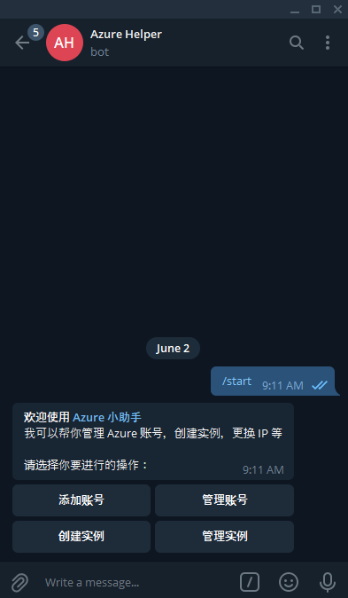
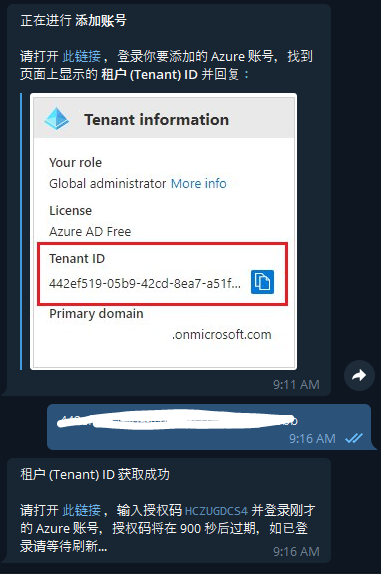
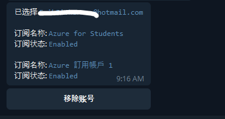
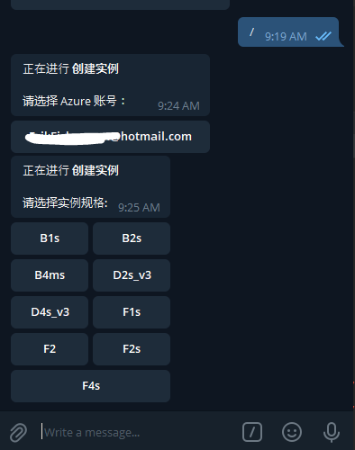
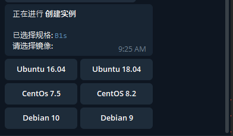
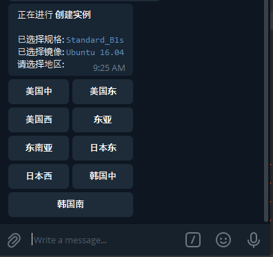
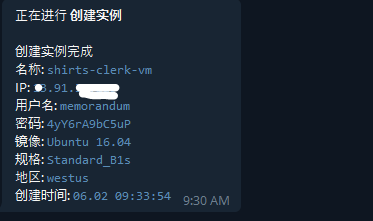
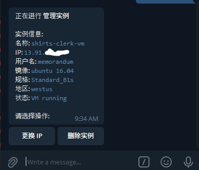

# 🏺 `azure-helper-bot`


### 🍾 用 telegram bot 管理 Azure 虚拟机

### 🔖 主要功能

+ 管理 Azure 账号，管理账号订阅
+ 创建和管理 Azure 虚拟机，更换虚拟机 IP

### 📦 部分截图

1. 账号添加和管理

   

   

   

2. 实例创建和管理

   

   

   

   

   

### 🌌 用法

1. 在 [@botfather](https://t.me/botfather) 新建一个 bot，记下 `bot token`

2. 选择相应的系统平台，下载 release 中的一键包和 `config.json`

3. 按照你的需求编辑 `config.json`，`*` 的部分需要去掉或编辑

   ```
   {
     "BOT": {
       "NAME": "Azure 小助手",
       "TOKEN": "*bot 的 token",
       "ADMINS": [*你的 telegram 数字 id]
     },
     "VM": {
       "DISK_SIZE_DEFAULT": *默认磁盘大小,
       "LOCATIONS": {
         "*创建虚拟机时显示的地区": "*可根据需求编辑",
         "美国中": "centralus",
         "美国东": "eastus",
         "美国西": "westus",
         "东亚": "eastasia",
         "东南亚": "southeastasia",
         "日本东": "japaneast",
         "日本西": "japanwest",
         "韩国中": "koreacentral",
         "韩国南": "koreasouth"
       },
       "SIZES": {
         "*创建虚拟机时显示的虚拟机型号": "*可根据需求编辑",
         "B1s": "Standard_B1s",
         "B2s": "Standard_B2s",
         "B4ms": "Standard_B4ms",
         "D2s_v3": "Standard_D2s_v3",
         "D4s_v3": "Standard_D4s_v3",
         "F1s": "Standard_F1s",
         "F2": "Standard_F2",
         "F2s": "Standard_F2s",
         "F4s": "Standard_F4s"
       },
       "OS_INFOS": {
         "*创建虚拟机时显示的虚拟机镜像": "*可根据需求编辑",
         "Ubuntu 16.04": {
           "os": "Ubuntu 16.04",
           "image_reference": {
             "publisher": "Canonical",
             "offer": "UbuntuServer",
             "sku": "16.04-LTS",
             "version": "latest"
           }
         },
         "Ubuntu 18.04": {
           "os": "Ubuntu 18.04",
           "image_reference": {
             "publisher": "Canonical",
             "offer": "UbuntuServer",
             "sku": "18.04-LTS",
             "version": "latest"
           }
         },
         "CentOs 7.5": {
           "os": "CentOs 7.5",
           "image_reference": {
             "publisher": "OpenLogic",
             "offer": "CentOS",
             "sku": "7.5",
             "version": "latest"
           }
         },
         "CentOS 8.2": {
           "os": "CentOS 8.2",
           "image_reference": {
             "publisher": "OpenLogic",
             "offer": "CentOS",
             "sku": "8_2",
             "version": "latest"
           }
         },
         "Debian 10": {
           "os": "Debian 10",
           "image_reference": {
             "publisher": "debian",
             "offer": "debian-10",
             "sku": "10",
             "version": "latest"
           }
         },
         "Debian 9": {
           "os": "Debian 9",
           "image_reference": {
             "publisher": "credativ",
             "offer": "Debian",
             "sku": "9",
             "version": "latest"
           }
         }
       }
     }
   }
   ```

4. 给予运行权限并运行

   ```
   chmod +x az*
   /az*
   ```

   

### 🐛 使用问题

+ 不是通过 bot 创建的虚拟机可能更换 IP 等操作失败
+ 不支持多个订阅的账号
+ 由于使用设备码 `(device code)` 授权，token 有效期只有 3 个月，之后需要重新添加

***

+ bot 年久失修，满足日常简单需求，不再维护
+ 新版网页版 Azure 小助手已经发布

